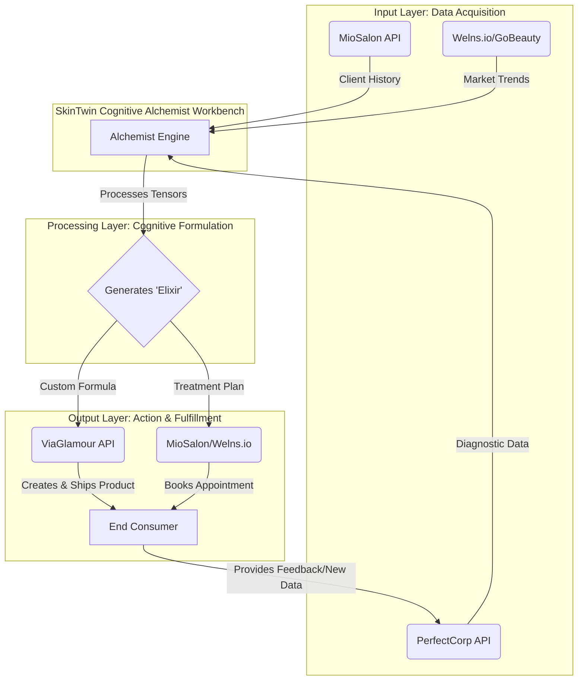

# SkinTwin Cognitive Alchemist Workbench: Integration Analysis

**Author:** Manus AI
**Date:** January 15, 2026

## 1. Executive Summary

This document presents a comprehensive analysis of several platforms within the beauty and wellness technology sector, outlining their strategic significance and proposing a framework for their integration into the **SkinTwin Cognitive Alchemist Workbench**. The research reveals a complete, end-to-end ecosystem, from consumer-facing marketplaces and B2B management software to cutting-edge AI diagnostics and white-label manufacturing. By integrating these components, the Alchemist Workbench can be positioned as a central cognitive engine that orchestrates a hyper-personalized skincare and beauty experience, from initial diagnosis to product formulation and fulfillment.

The core discovery is the identification of four key pillars of the modern beauty-tech stack:

1.  **AI-Powered Diagnostics:** Represented by **Perfect Corp**, providing medical-grade, API-accessible skin analysis.
2.  **Two-Sided Marketplaces:** Exemplified by the **MioSalon/Welns.io** duo, which combines a B2B SaaS management platform for salons with a B2C booking marketplace for consumers.
3.  **White-Label Manufacturing & Dropshipping:** Embodied by **ViaGlamour**, which offers custom formulation and direct-to-consumer fulfillment via a Shopify app.
4.  **Regional Marketplaces:** Illustrated by **GoBeauty.co.za**, which provides a blueprint for localized consumer-facing service platforms.

This analysis proposes that the Alchemist Workbench acts as the intelligent core, using its tensor transformation capabilities to process data from these pillars and generate personalized "elixirs"—not just as data outputs, but as actionable recipes for custom product formulations and treatment plans.

## 2. Deconstruction of the Beauty-Tech Ecosystem

The research has identified distinct, yet interconnected, layers of the digital beauty and wellness industry. Each researched entity represents a critical component in a comprehensive value chain.

| Platform | Role in Ecosystem | Key Functionality | Data Type | Integration Point |
| :--- | :--- | :--- | :--- | :--- |
| **Perfect Corp** | The Diagnostic Engine | AI Skin Analysis, Virtual Try-On, API | Raw diagnostic data (skin scores) | **Input Tensor** for Alchemist Engine |
| **MioSalon** | The Business Engine | B2B Salon/Spa Management SaaS | Structured business & client data | **Contextual Tensor** for Alchemist Engine |
| **Welns.io** | The Consumer Marketplace | B2C Appointment Booking | Consumer behavior & preference data | **Deployment Channel** & Data Source |
| **ViaGlamour** | The Manufacturing Engine | White-Label Cosmetics & Dropshipping | Product formulas, inventory data | **Actionable Output** from Alchemist Engine |
| **GoBeauty.co.za** | The Regional Blueprint | South African B2C Marketplace | Market trends & regional service data | **Market Intelligence** Data Source |

This ecosystem can be visualized as a continuous loop, orchestrated by the Alchemist Workbench.

*Figure 1: Proposed integration workflow for the SkinTwin Cognitive Alchemist Workbench.* 

## 3. Proposed Integration with Alchemist Workbench

The **Alchemist Engine**, with its framework of `Elixirs`, `Tensors`, and `Reactor Vessels`, is perfectly suited to serve as the cognitive core of this ecosystem. The integration would transform the abstract concept of tensor manipulation into a tangible, value-creating process.

### 3.1. Data as Input Tensors

The initial state would involve ingesting data from the various platforms as input `tensors` for the Alchemist Engine:

-   **Primary Diagnostic Tensor:** The rich, multi-dimensional data from a **Perfect Corp** AI Skin Analysis becomes the primary input. This is not a single value but a complex tensor representing the 16 skin concerns (spots, wrinkles, moisture, etc.), skin type, and skin age.
-   **Client History Tensor:** Data from a platform like **MioSalon** (accessed via API) would form a secondary tensor, providing historical context such as past treatments, product purchase history, and appointment frequency.
-   **Market Context Tensor:** Aggregated, anonymized data from marketplaces like **Welns.io** or **GoBeauty** could provide a third tensor representing market trends, popular ingredients, or regional environmental factors.

### 3.2. The "Skincare Elixir": A Transformation Recipe

The core logic resides in a series of "elixirs"—transformation recipes registered within the Alchemist Engine. A `Skincare Elixir` would be a multi-step pipeline designed to transmute the raw input data into a hyper-personalized output.

**Example `Skincare Elixir` Pipeline:**

1.  **Step 1: Diagnostic Fusion:** The elixir's first step fuses the **Primary Diagnostic Tensor** with the **Client History Tensor**. It correlates the current AI-detected skin concerns with past treatments to identify recurring issues or measure the efficacy of previous interventions.

2.  **Step 2: Causal Inference:** The engine applies a custom function to identify potential causal relationships. For example, it might correlate high `oiliness` and `acne` scores with a client's frequent use of a known comedogenic product from their purchase history.

3.  **Step 3: Ingredient Mapping:** The transformed tensor, now representing a refined understanding of the user's skin needs, is passed through a mapping function. This step translates skin concern scores into a required ingredient profile (e.g., `redness > 0.8` maps to `Niacinamide: 5%`, `moisture < 0.3` maps to `Hyaluronic Acid: 2%`).

4.  **Step 4: Formulation Generation:** The ingredient profile is processed to generate a final product formula. This step leverages **ViaGlamour's** catalog of 800+ base formulas and available ingredients, ensuring the generated formula is manufacturable. The output is a structured JSON object representing the custom product recipe.

5.  **Step 5: Treatment Plan Generation:** In parallel, the engine generates a recommended treatment plan, suggesting professional services available on **Welns.io** or **GoBeauty** that complement the custom-formulated product.

### 3.3. Actionable Outputs: From Tensor to Tangible Product

The final output of the Alchemist Engine is not just data, but an actionable command.

-   **ViaGlamour API Call:** The generated product formula is sent directly to the **ViaGlamour API**. This triggers the manufacturing and dropshipping of a unique, personalized skincare product, complete with custom branding, directly to the consumer.
-   **MioSalon/Welns.io Integration:** The recommended treatment plan can be used to automatically suggest or even book appointments at a local salon through the **Welns.io** marketplace, with the details logged in the client's **MioSalon** profile.

## 4. Strategic Implications

This integrated system represents a significant leap beyond simple product recommendations. It creates a closed-loop, learning ecosystem where every interaction provides new data to refine the Alchemist Engine's future transformations.

-   **Hyper-Personalization at Scale:** Moves from segment-based recommendations to true one-to-one personalization for both products and services.
-   **Data-Driven Product Development:** Anonymized data can reveal unmet needs in the market, guiding the development of new base formulas for ViaGlamour.
-   **End-to-End Value Chain Ownership:** By integrating these four pillars, SkinTwin can orchestrate the entire customer journey, from the initial spark of interest to the delivery of a physical product and the booking of a professional service.

## 5. Conclusion and Next Steps

The research confirms that the components for a revolutionary, AI-driven beauty-tech ecosystem are readily available. The key lies in the integration, and the **SkinTwin Cognitive Alchemist Workbench** is the ideal platform to serve as the central nervous system for this integration.

**Recommended Next Steps:**

1.  **API Validation:** Prioritize a technical deep-dive into the **Perfect Corp (YouCam) API** using the provided `openapi.json` specification to validate the data structure of the skin analysis output.
2.  **Partnership Exploration:** Initiate strategic discussions with **ViaGlamour** to understand the parameters and constraints of their custom formulation API.
3.  **Pilot Elixir Development:** Begin development of a proof-of-concept `Skincare Elixir` within the Alchemist Engine, using mock data based on the Perfect Corp API to simulate the transformation pipeline.

By taking these steps, the SkinTwin project can move from a conceptual framework to a powerful, market-ready platform that truly embodies the promise of cognitive alchemy.

---

### References

[1] MioSalon. (2026). *Salon and Spa Software*. Retrieved from https://www.miosalon.com/

[2] Welns.io. (2026). *Search salons nearby*. Retrieved from https://www.welns.io/

[3] GoBeauty. (2026). *Your Favourite Salons and Spas in your pocket*. Retrieved from https://gobeauty.co.za/

[4] viaGlamour. (2026). *viaGlamour Cosmetics Lab*. Retrieved from https://viaglamour.com/

[5] Shopify App Store. (2026). *viaGlamour | Dropship Skincare*. Retrieved from https://apps.shopify.com/viaglamour-start-your-makeup-line

[6] Perfect Corp. (2026). *AI Skin Analysis & Face Mapping & Diagnostic for Skincare Routines*. Retrieved from https://www.perfectcorp.com/business/products/ai-skin-diagnostic

[7] Perfect Corp. (2026). *Skin Analysis Online Tool & App*. Retrieved from https://www.perfectcorp.com/business/showcase/skincare/home

[8] Perfect Corp. (2026). *Skincare Pro | AI Skin Scanner for Skincare Recommendation*. Retrieved from https://www.perfectcorp.com/business/solutions/online-service/skincare-pro

[9] Perfect Corp. (2026). *Beauty AR Company and Makeup AR Technology Platform*. Retrieved from https://www.perfectcorp.com/business/plan?functionType=SKINCARE_PRO
